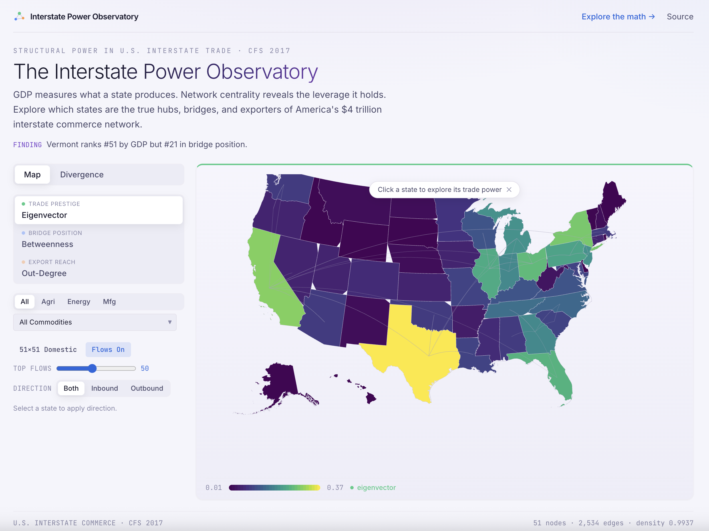

# The Interstate Power Observatory: A Pre-Registered Forecast of U.S. Trade-Network Centrality (2012–2022)

## Project at a glance

A state's GDP tells you how much it produces. It doesn't tell you how much of the country's trade has to flow through it. Those are two different kinds of economic power, and they don't always track each other. In a recently defended master's thesis built on federal trade data, 39% of U.S. states sit five or more rank positions away from their GDP rank once you measure their structural position in the interstate trade network. Kentucky ranks 14 positions higher on structure than on size. Mississippi, 10.

One pattern surfaced that we were not looking for. Of the eight states the framework flags as most structurally undervalued, seven have since drawn over $170 billion in announced AI data center investment, sited for the same physical infrastructure (energy, grid, logistics) that drives network centrality. We report this as a striking correlation, not a causal claim. It is the kind of signal the framework exists to surface, it emerged unprompted, and it is worth watching as more siting decisions land.

The thesis validated the method on one year (2017) and put it online as a live, interactive dashboard anyone can open today. This project extends it across the last decade. Before computing a single cross-year number, we publicly register three numeric forecasts for how that structure should hold or break across 2012, 2017, and 2022, then resolve them in the open. The data are free federal releases. The pipeline is built and validated. Funding buys the one piece not yet in place: the full three-year analysis at scale, and the public Observatory upgraded so anyone can watch interstate power shift and see each forecast resolve, with no code required.

## Deliverables

1. **The Interstate Power Observatory (live, public).** The existing single-year dashboard, already online at [tradeflows.halcyonic.systems](https://tradeflows.halcyonic.systems), extended into a three-survey instrument where anyone can watch state-level economic power shift from 2012 to 2022 and see each registered forecast resolve. No code, no paywall, no login.
2. **Three pre-registered forecasts, resolved in public.** Numeric predictions registered before any cross-year number is computed, then tested and reported as holds or breaks, with public Manifold prediction markets on each. Both outcomes are findings.
3. **Community-shaped and fully open.** Every data file, configuration, threshold, and run artifact is public on GitHub ([github.com/rsthornton/us-trade-centrality](https://github.com/rsthornton/us-trade-centrality)) from day one and archived under a DOI, so anyone can rerun and audit the pipeline. Observatory improvements are driven directly by ResearchHub community feedback, prioritizing readability and utility for a non-technical audience.

## 1. Abstract

Network centrality analysis of the interstate trade network measures a kind of structural economic power that GDP misses. A recently defended master's thesis validated this on the 2017 Commodity Flow Survey, with a public pipeline and a live dashboard: centrality correlates closely with GDP yet diverges by five or more rank positions for 39% of states. The single open question is temporal: whether that structure held across the last decade, and whether it survived COVID-era disruption.

This project answers it as a public, pre-registered forecast. Before computing anything across years, we register three hypotheses with numeric thresholds (hub stability, corridor persistence, commodity sensitivity), then test them: retrodict 2012 from 2017's network, which should hold if the structure is real, and predict 2022, the live disruption test. If the backward test holds and the forward one breaks, that gap measures where the pandemic restructured trade rather than merely describing it. Because the thresholds are fixed before any cross-year number exists, the forecasts can't be tuned to fit the answer after the fact.

The thresholds are mirrored one-to-one in a machine-readable file the analysis code reads, so the registered claims and the computed verdicts cannot drift. The funded deliverable is the observatory itself: the live dashboard extended to a public, three-survey instrument where anyone can watch interstate power shift and see each forecast resolve, no code required. This is a one-month solo project on entirely public federal data, so no ethics approvals are required. All data, code, configurations, and run artifacts are public from day one.

## 2. Introduction

The thesis behind this proposal tested whether network centrality can measure structural economic power among U.S. states, and whether it reveals importance that GDP misses [10]. Using the 2017 Commodity Flow Survey, it constructed the 51-node interstate trade network and computed three complementary centrality measures: betweenness (whether other states' trade routes through it), eigenvector (influence through important partners), and out-degree (direct distribution capacity). Three results matter here. First, the method is reliable: all three measures showed perfect rank stability (ρ = 1.000) under graph filtration to the 33% threshold, addressing the instability concerns raised for centrality on weighted graphs [9]. Second, centrality tracks economic scale but is not reducible to it: eigenvector centrality correlates with state GDP at ρ = 0.934, yet 39% of states diverge by five or more rank positions between the two rankings. Kentucky ranks 14 positions higher on structure than on GDP; Mississippi, 10. Third, the divergences line up with a pattern we did not set out to find: seven of the eight states the framework identifies as structurally undervalued have drawn major AI data center investment since 2024, over $170 billion announced [14–18]. Those siting decisions weigh the same physical infrastructure (energy, grid, logistics corridors) that drives centrality, which makes the correlation suggestive. We treat it as an open question for further study, not evidence of causation.

The framework is validated on one snapshot. The next question is temporal. The 2012 survey offers a clean pre-period: years of relative continuity in which structural positions should be stable if the framework measures something real. The 2022 survey raises a sharper question: which states' structural positions shifted under COVID-era supply chain disruption, and which proved resilient? Jang and Yang, whose longitudinal work on international trade networks is the closest precedent [5,6], discarded post-COVID data to avoid conflating disruption with structural change. That conflation is precisely what a disruption-focused analysis should illuminate. Related work has examined U.S. supply chain chokepoints [7], food distribution centrality [8], and import-export network structure [4], but no study has tracked state-level structural power across all three modern CFS releases.

The design makes 2017 the anchor and treats both comparisons as forecasts. Backward, we retrodict 2012: if the framework captures durable structure, 2017's rankings should reconstruct 2012's within tight thresholds. Forward, we predict 2022: the same thresholds become a live disruption test. Retrodiction holding while prediction breaks would quantify, hypothesis by hypothesis, exactly where COVID-era disruption restructured interstate trade and where path dependence won. Retrodiction failing would falsify the stability premise and bound the framework's claims. Either outcome is informative, and every threshold is registered before any cross-year number is computed.

This design extends a model ResearchHub itself has been piloting [20]: forecasting markets on Manifold tied to the pre-registered studies it funds, letting the crowd predict outcomes before results are in. Each forecast below is a concrete, dated, resolvable claim of the form "will the 2017-anchored prediction hold for 2022?". After pre-registration, we open these as public Manifold markets, extending that model from replication outcomes to structural forecasting. The output is also a public instrument, not only a paper: a standing observatory that makes structural economic position legible to citizens and policymakers the way GDP figures already are, with the federal PNNL Data Center Atlas as precedent [19].

### Hypotheses

2017 is the base year in every pair. Each registered hypothesis is stated twice: the retrodiction form (suffix R, 2017 to 2012, expected to hold) and the prediction form (suffix P, 2017 to 2022, the live forecast). Three hypotheses are pre-registered with numeric thresholds: H1 and H2 are primary outcomes, H3 is secondary. Two further structural questions (regional bloc stability and trade-imbalance concentration) are computed and reported as exploratory analyses rather than pre-registered forecasts, because their cutoffs are not yet well-motivated; each can graduate to a registered hypothesis in a future round.

**H1 (primary): Hub centrality stability.** The high-ranked states stay high for the measures tied to physical production and distribution (eigenvector, out-degree), which change slowly, but not for the routing-based measure (betweenness), which reshuffles as logistics shift.

- **Forecast, both pairs:** Spearman ρ ≥ 0.90 for eigenvector and out-degree; ρ < 0.85 for betweenness; at least 8 of the top 10 eigenvector states shared.
- **If H1-R holds:** structural position is path-dependent in the calm pre-period, as the framework requires.
- **If H1-R breaks:** the rankings fail to reconstruct even the calm pre-period, so the method is too unstable to tell a real 2022 disruption apart from the measure's own noise. Any 2022 break is then a method limit, not evidence of COVID.
- **If H1-P holds:** hub structure survived COVID.
- **If H1-P breaks:** the measures that broke localize the disruption (eigenvector breaking implies partner-structure reorganization; betweenness alone implies rerouting without hierarchy change).

**H2 (primary): Backbone corridor persistence.** The network backbone (the top third of edges by value) persists.

- **Forecast, both pairs:** Jaccard similarity of backbone edge sets ≥ 0.80.
- **If it holds:** major corridors reflect geographic and infrastructural fundamentals that change slowly.
- **If it breaks (P only):** COVID-era disruption reached the trunk routes themselves, not just marginal flows.

**H3 (secondary): Commodity-specific sensitivity.** Disruption concentrates in pandemic-exposed commodities. Pharmaceuticals, with concentrated foreign sourcing and lean inventories, had more exposed distribution networks than domestically-sourced staples like agriculture. For each commodity, Δ measures how much its flow pattern changed across a pair: one minus the cosine similarity of its edge-weight vectors (cosine compares the shape of the flows independent of overall volume, so a decade of growth does not register as disruption).

- **Forecast:** H3-R, |Δ(pharmaceuticals, SCTG 21) − Δ(agriculture, SCTG 01-05)| ≤ 0.10 (both stable pre-period); H3-P, Δ(pharmaceuticals) > Δ(agriculture).
- **If it holds:** structural change is sector-localized, consistent with a disruption mechanism.
- **If it breaks:** change is broad-based or located elsewhere. The per-commodity Δ ranking (exploratory) identifies where.

### Exploratory analyses (computed and reported, not pre-registered)

Two further structural questions are computed for all three years and reported, but carry no registered pass/fail threshold, because the right cutoffs are not yet well-motivated. Each can sharpen into a registered hypothesis in a future round, once there is data and intuition behind the number.

1. **Regional bloc stability (community structure).** The trade network partitions into communities: clusters of states that trade far more with each other than with outsiders, detected with the Louvain algorithm (fixed seed). These blocs are typically geographic. We report how much the partition shifts across each year pair (normalized mutual information between partitions) and which states change blocs, illuminating whether COVID-era disruption redrew regional trade groupings.
2. **Trade-imbalance concentration (flow asymmetry).** For each state pair, net flow is the directional imbalance between the two states. We report the Gini coefficient over absolute net flows across all pairs (an inequality measure: higher means a few pairs carry most of the imbalance) and how it moves across years, indicating whether the recovery concentrated surpluses and created import-dependent states.

## 3. Methods

### Sample

No human participants. The sample is the complete set of usable shipment records in three federal public-use microdata releases: the 2012 CFS PUM file (4.5 million records) [11], the 2017 CFS PUF (5.98 million records, ~$13 trillion in annual interstate trade) [12], and the 2022 CFS PUMS (37.5 million sampled, weighted records) [13]. All three are already in hand. Because each file is the full public release rather than a drawn sample, a power analysis does not apply; inferential discipline comes instead from pre-registered thresholds, survey weights, and the variance guidance published with each release (the 2022 file ships a generalized variance function; comparability of variance estimates across years is documented as a limitation where the 2017 documentation lacks an equivalent).

**Inclusion:**

- Interstate shipments with valid origin and destination state codes and positive weighted value.

**Exclusion:**

- Intrastate flows.
- SCTG 16 (crude petroleum), in all years, because it is out of scope for the 2022 survey.
- Grouped commodity codes covering SCTG 16, in all years for parity.

### Materials and Procedures

The pipeline is the thesis pipeline, unchanged in its core: load microdata; weight shipment values (edge weight = WGT_FACTOR × SHIPMT_VALUE); aggregate to origin-destination state pairs; construct a directed weighted 51-node graph; compute betweenness (with weight inversion so high trade value means short distance), eigenvector, and out-degree centrality; filter to the 33% backbone for robustness checks. The 2017 implementation is public ([github.com/rsthornton/us-trade-centrality](https://github.com/rsthornton/us-trade-centrality)), and two live artifacts demonstrate it: an interactive dashboard (tradeflows.halcyonic.systems) and a reproducible notebook (molab.marimo.io/notebooks/nb_nMExyXbgvNSdHcr7C9EjfZ/app).

Running a new survey year requires a year configuration file and a matching state GDP control file (BEA SQGDP1, current-dollar, Q4), not structural code changes. Five documented comparability caveats govern the cross-year comparison:

1. The 2022 release is a PUMS sample while 2012 and 2017 are full files, so weighted aggregates are comparable but variance estimation differs.
2. SCTG 16 scope change and differential grouped-code collapsing.
3. 2022 disclosure avoidance truncates values above $30 million and topcodes weights.
4. 2022 drops QUARTER, routed distance, and NAICS.
5. Variance functions differ by release.

Each is mitigated rather than left open: the go/no-go gates below bound the sampling, grouping, and disclosure effects (caveats 1–3); SCTG 16 and its grouped codes are dropped in every year for parity (caveat 2); the fields 2022 omits are used by no registered hypothesis, since betweenness inverts trade value rather than using routed distance (caveat 4); and variance comparability across releases is reported as a stated limitation (caveats 1 and 5). Because 2022 is a PUMS sample while the anchor years are full files, a 2022-prediction break cannot be cleanly partitioned into structural change and sampling variance; the go/no-go gates cap the gross sampling and disclosure effects, and the full-file-to-full-file 2012↔2017 retrodiction calibrates the thresholds on comparability-clean data, so a prediction break is read as an upper bound on disruption rather than a clean point estimate.

Before any hypothesis test, four go/no-go gates run per year:

1. Computed national totals within ±5% of published totals.
2. SCTG 16 excluded everywhere.
3. Grouped-code prevalence below 5% of records.
4. Truncation affecting below 1% of records.

A gate failure stops the analysis and is reported as such.

### Planned Analyses

Every threshold above is mirrored one-to-one in a machine-readable thresholds file committed to the public repository before any cross-year computation; its registered SHA-256 hash is `cd25810026b8053aad446aa0a6e3a3050642c1cf492d988dc02e3db185bc30e1`. A single entry point builds the three yearly networks, runs the gates, evaluates the retrodiction pair and the prediction pair, and emits a verdict table (H1-R through H3-P, HOLD or BREAK; the exploratory metrics are reported alongside without a verdict) plus a machine-readable results file carrying the SHA-256 hash of the thresholds it was evaluated against. Statistical tests: Spearman ρ and Kendall τ for rank stability (H1), Jaccard similarity on backbone edge sets (H2), cosine distance on commodity edge-weight vectors (H3), normalized mutual information on Louvain partitions with fixed seed and Gini coefficients over net flows (both exploratory).

Interpretation is symmetric and stated per hypothesis above: holds and breaks are both findings, and the headline result is the retrodiction/prediction asymmetry pattern across the three registered hypotheses. Deviations: if a gate fails (for example grouped-code prevalence above 5% in a commodity family), the affected hypothesis is reported with the deviation flagged and, where possible, recomputed at the grouped-code unit of analysis; no threshold is altered after registration. Exploratory analyses (regional bloc stability, trade-imbalance concentration, per-commodity Δ rankings, state-level rank trajectories, GDP-centrality divergence over time) are labeled exploratory.

### Ethics and Data Management

All data are public federal statistical releases; no IRB approval is required. The repository (pipeline, configurations, thresholds file, run artifacts with config hashes) is public on GitHub from the start ([github.com/rsthornton/us-trade-centrality](https://github.com/rsthornton/us-trade-centrality)), and final results will be archived with a DOI. AI assistance is used deliberately and disclosed: Claude models (Anthropic) supported code scaffolding and document consolidation under direct author review; every statistical analysis is deterministic scripted code, publicly auditable, and verified by the author.

**Open commitments:**

- Pre-registration of this protocol on ResearchHub.
- Public prediction markets on the H-P forecasts (Manifold) after registration.
- Open data, open pipeline, open run logs.
- The live dashboard (tradeflows.halcyonic.systems) upgraded to a three-survey comparative view as a funded deliverable, so results are inspectable without reading code.
- Ongoing improvement of the dashboard in response to ResearchHub community feedback, prioritizing utility and readability for a non-technical audience.

## 4. Pilot Data

The pilot is the defended master's thesis, at full scale (ProQuest 3343535100 [10]). Its 2017 analysis is validated end to end: computational reproducibility to machine precision, the betweenness weight-inversion correction locked in, and rank stability confirmed under filtration (ρ = 1.000 for all three measures at the 33% threshold, the maximum before fragmentation). Baseline results the forecasts will be scored against: top eigenvector states TX, CA, NY; top betweenness CA, TX, NY; top out-degree CA, TX, IL; eigenvector-GDP correlation ρ = 0.934; 39% of states diverging five or more ranks between GDP and centrality. Feasibility of the extension is already demonstrated: all three survey files are on disk, the 2012 and 2022 state GDP control files are built from BEA tables, and the cross-year scaffolding (gates, hypothesis tests, verdict reporting) runs end to end on sampled data. The full study is the same machinery at full record counts.

## 5. Budget

Total request: **$1,000** over approximately one month. The method is proven and the data are free, so there is no failed-study risk: the question is what gets built, not whether it works. Funding builds the public apparatus a quick private check would never produce: the three-survey Observatory, the seeded prediction markets, and the archived, rerunnable open pipeline that let anyone inspect and audit the result. And because every threshold is registered before any cross-year number is computed, whether the forecasts hold or break, the result is a published, pre-registered finding about how U.S. trade structure moved through the last decade. Per ResearchHub guidance these line items are not binding and can be adjusted.

| Item | Amount |
|---|---|
| Full three-year analysis (three full-scale survey runs, gate verification, results writeup) | $500 |
| The Interstate Power Observatory: tradeflows.halcyonic.systems extended to a three-survey comparative view (rank trajectories, verdict table, per-hypothesis evidence) | $250 |
| Open replication infrastructure (public repository hardening, archived run artifacts, documentation) | $150 |
| Dissemination (prediction market creation and seeding on the H-P forecasts) | $100 |
| **Total** | **$1,000** |

The dashboard upgrade is a committed deliverable, not a contingency: the current single-year dashboard is already live, and the three-survey view ships with the results so anyone can inspect the forecasts and their resolutions without reading code.

## 6. References

1. Arthur, W. B. Foundations of complexity economics. *Nature Reviews Physics* **3**, 136-145 (2021).
2. Emmert-Streib, F., Tripathi, S., Yli-Harja, O. & Dehmer, M. Understanding the world economy in terms of networks. *Frontiers in Applied Mathematics and Statistics* **4**, 37 (2018).
3. Farrell, H. & Newman, A. L. Weaponized interdependence: how global economic networks shape state coercion. *International Security* **44**, 42-79 (2019).
4. Goulias, K. G. & Shi, H. Complex network analysis of imported and exported goods in the United States of America. In *Computational Science and Its Applications - ICCSA 2024 Workshops* 346-365 (Springer, 2024).
5. Jang, Y. & Yang, J.-S. Network analysis of the US-China hegemonic transition. *SSRN* 3535056 (2020).
6. Jang, Y. & Yang, J.-S. Measuring the network power of states: the United States versus China. *Korean Journal of Defense Analysis* **35**, 595-619 (2023).
7. Karakoc, D. B., Konar, M., Puma, M. J. & Varshney, L. R. Structural chokepoints determine the resilience of agri-food supply chains in the United States. *Nature Food* **4**, 607-615 (2023).
8. Miller, M., Konar, M., Hanawa Peterson, H., Court, C., Shakya, S. & Stevens, A. Network centrality in perishable food distribution networks in the United States. *Environmental Research: Food Systems* **2**, 025007 (2025).
9. Segarra, S. & Ribeiro, A. Stability and continuity of centrality measures in weighted graphs. In *IEEE ICASSP 2015* 3387-3391 (2015).
10. Thornton, R. S. Testing network centrality for economic power measurement: structure and boundaries in U.S. interstate trade. MS thesis, Binghamton University. ProQuest 3343535100 (2026). https://www.proquest.com/docview/3343535100
11. U.S. Census Bureau. 2012 Commodity Flow Survey Public Use Microdata File (2015).
12. U.S. Census Bureau. 2017 Commodity Flow Survey Public Use File (2019).
13. U.S. Census Bureau. 2022 Commodity Flow Survey Public Use Microdata Sample (2024).
14. Office of Governor Tate Reeves. Tech leader xAI investing more than $20 billion in Southaven (2026). https://governorreeves.ms.gov/tech-leader-xai-investing-more-than-20-billion-in-southaven/
15. Office of Governor Tate Reeves. Governor Tate Reeves announces Amazon plans to invest $3 billion in Vicksburg (2025). https://governorreeves.ms.gov/governor-tate-reeves-announces-amazon-plans-to-invest-3-billion-in-vicksburg/
16. Office of Governor Tate Reeves. Compass Datacenters project generates $10 billion investment in Lauderdale County (2025). https://governorreeves.ms.gov/compass-datacenters-project-generates-10-billion-investment-in-lauderdale-county/
17. Opportunity Louisiana. Hut 8 selects Southeast Louisiana as site of $10 billion artificial intelligence data center (2025). https://www.opportunitylouisiana.gov/news/hut-8-selects-southeast-louisiana-as-site-of-10-billion-artificial-intelligence-data-center
18. Opportunity Louisiana. Amazon selects Louisiana for $12 billion data center campuses in major U.S. expansion (2025). https://www.opportunitylouisiana.gov/news/amazon-selects-louisiana-for-12-billion-data-center-campuses-in-major-u-s-expansion
19. Pacific Northwest National Laboratory. Data Center Atlas (2025). https://im3.pnnl.gov/datacenter-atlas
20. ResearchHub Foundation. Prediction markets on ResearchHub-funded studies (Manifold) (2026). https://x.com/ResearchHubF/status/2049156789229494758
